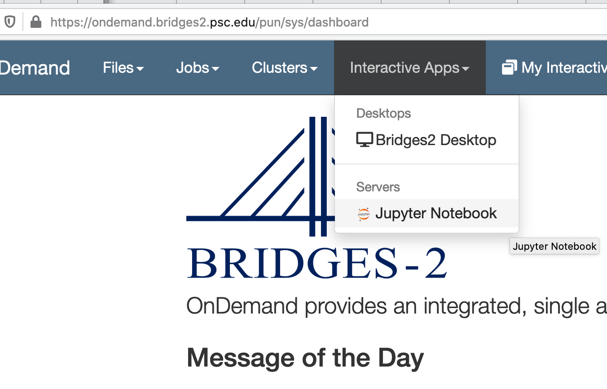
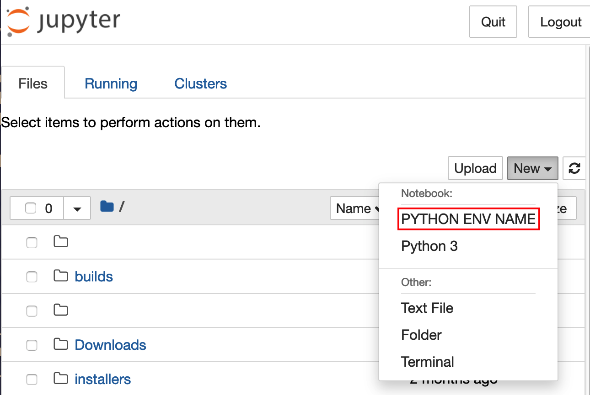

# How to use Singularity containers from Jupyter notebook

Similar to the process described
on [Stack Overflow for starting a Jupyter Notebook from Docker](https://stackoverflow.com/questions/63702536/jupyter-starting-a-kernel-in-a-docker-container)
, a Python installation inside a Singularity container can be used from Jupyter Notebook as well.

For doing so, create a directory under `$HOME/.local/share/jupyter/kernels/`, in which a `kernel.json` file will be
created with the commands required for Singularity to start the python binary and Jupyter Notebook to see it as a
kernel.

Next, identify the Singularity container image to use as a Jupyter Noktebook kernel and place the full path in the file
under the `--bind` flag and paths. For example, if you would like to set up a container to start the Python binary from
the latest NGC TensorFlow container, set the container path (`/ocean/containers/ngc/tensorflow/latest.sif`), the Python
binary to call (`python`), and then set the display name to use (`tensorflow_latest`).

Example for using the latest Bridges-2 TensorFlow version:

```shell
mkdir -p $HOME/.local/share/jupyter/kernels/tensorflow_latest/
vim $HOME/.local/share/jupyter/kernels/tensorflow_latest/kernel.json
```

__kernel.json:__

```json
{
  "argv": [
    "/usr/bin/singularity",
    "exec",
    "--bind",
    "/ocean,{connection_file}:/connection-spec",
    "/ocean/containers/ngc/tensorflow/latest.sif",
    "python",
    "-m",
    "ipykernel_launcher",
    "-f",
    "/connection-spec"
  ],
  "display_name": "tensorflow_latest",
  "language": "python"
}
```

Then start Jupyter Notebook and select the newly created kernel. The libraries inside the container should be there.

# Start the custom Jupyter Notebook kernel

Go to [OnDemand](https://ondemand.bridges2.psc.edu/), start a Jupyter Notebook, select the custom Kernel from the list.

Then open Jupyter Notebook as usual, and choose the newly created kernel by navigating to
**Interactive Apps > Jupyter Notebook > Launch > Connect to Jupyter >**



Then, if you already have a notebook, change the Python environment to use by reloading the web page, and then navigate
the menus to choose the new Python environment to use: **Kernel > Change kernel > "PYTHON ENV NAME"**.

And if you haven’t started a notebook yet, create a new one using the “New“ menu and select the Python environment to
use: **New (dropdown) > [Notebook] PYTHON ENV NAME**:



__Note:__ For installing new packages, you will have to do it from the terminal and NOT from the Jupyter notebook itself
as it will try to use the base different Conda binaries and not the ones you set in the new custom env kernel.
