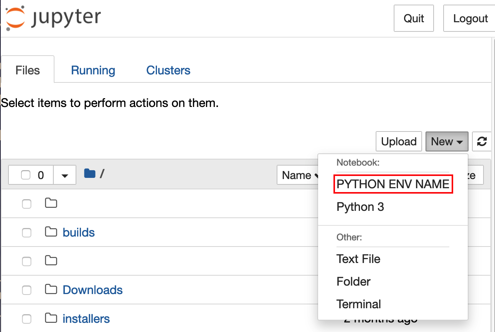

# How to use Singularity containers from Jupyter notebook

A Python installation inside a Singularity container can be used from Jupyter Notebook.

To do so, you must:
1. Create a directory for your Jupyter Notebook kernel
1. Create a JSON file named kernel.json in that directory with the commands required for Singularity to start the python binary and for Jupyter Notebook to see it as a
kernel
1. Connect to Bridges-2 using OnDemand
1. Start a Jupyter Notebook
1. Start the custom kernel with your Singularity container

## Create a directory for your new kernel

In this example, the new kernel will be named "tensorflow_latest". The new directory has the same name. You can choose any name that you like.

While logged in to Bridges-2 type

```shell
mkdir -p $HOME/.local/share/jupyter/kernels/tensorflow_latest/
```

## Create a JSON file

The content of this file will tell Singularity to start python and allow Jupyter Notebook to recognize it as a kernel.

Before creating the file, you must
 - identify the Singularity container you wish to use as a Jupyter Notebook kernel. You must put the full path to this container under the  `--bind` flag and paths.
 - decide which python binary to run (most likely "python")
 - choose a display name to use for it

This example uses the latest Tensorflow NGC container (the path to
this is `/ocean/containers/ngc/tensorflow/latest.sif` as shown below)
and runs python. The display name is set to "tensorflow_latest", but
you can choose any name you like.

Create a file named kernel.json with the following content. Replace the path to the Singularity container, the python binary to run, and the display name to suit your application.

```json
{
  "argv": [
    "/usr/bin/singularity",
    "exec",
    "--bind",
    "/ocean,{connection_file}:/connection-spec",
    "/ocean/containers/ngc/tensorflow/latest.sif",
    "python",
    "-m",
    "ipykernel_launcher",
    "-f",
    "/connection-spec"
  ],
  "display_name": "tensorflow_latest",
  "language": "python"
}
```

## Connect to Bridges-2 using OnDemand

See the instructions in the Bridges-2 User Guide section <a href="https://www.psc.edu/resources/bridges-2/user-guide-2-2#connect-to-bridges-2-using-ondemand" target="_blank">Connect to Bridges-2 using OnDemand</a>.

## Start a Jupyter Notebook

See the instructions in the Bridges-2 User Guide section <a href="https://www.psc.edu/resources/bridges-2/user-guide-2-2#jupyterhub" target="_blank">Running Jupyter Notebooks through OnDemand</a> to start a Jupyter Notebook under OnDemand.

## Start the custom Jupyter Notebook kernel

Now you are ready to start the newly created kernel. The libraries inside
the container should be there.


To create a new Notebook, click **New** and select the Python environment to use from the dropdown. 



<p>&nbsp;</p>

If you already have a notebook, change the Python environment to use by: **Kernel > Change kernel >** <i>new-environment-name</i>.


__Note:__ For installing new packages, you will have to do it from the
terminal and NOT from the Jupyter notebook itself as it will try to
use the base different Conda binaries and not the ones you set in the
new custom env kernel.
