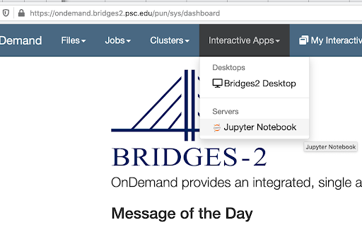
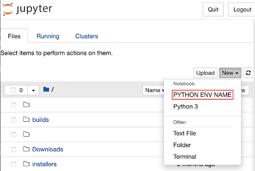

# Custom Conda Environments with OnDemand on Bridges-2

You can  use the Python “ipykernel” package to create a definition file for  Jupyter Notebook which
uses a custom Python installation rather than the default one. After creating that file and launching Jupyter Notebooks via
OnDemand, you can use your custom environment.

The steps to do this are:

1. Install “ipykernel”.
2. Create the custom Jupyter Notebook kernel.
3. Start the custom Jupyter Notebook kernel.

## Install “ipykernel”

This process can be performed with a custom Conda environment, with the Python installation in the Bridges-2 nodes, or
with any other Python installation available; the important thing is to run it from the Python environment that will 
be used with OnDemand.

The “ipykernel” package must be available in this environment to generate the custom kernel. The
“ipykernel” package can be removed after that.

### Load and activate the Anaconda3 module
In [an interactive session on Bridges-2](https://www.psc.edu/resources/bridges-2/user-guide-2/#interactive-sessions), load and activate anaconda3. 

```
module load anaconda3
conda activate # source /opt/packages/anaconda3/etc/profile.d/conda.sh
```

### Create a new environment

Create a new environment and install the “ipykernel” package along with any other packages you might need.
You could also install “ipykernel” to any existing Conda environment you have.

To create a new environment which includes ipykernel:

```
conda create --name ENVIRONMENT_NAME ipykernel
conda activate ENVIRONMENT_NAME
```

To add ipykernel to an existing environment:

```
conda install ipykernel
# or
python3 -m pip install ipykernel
# or
python3 -m pip install ipykernel --user
```

## Create the custom Jupyter Notebook kernel

Run “ipykernel” to create the custom Jupyter Notebook kernel, so that the Python installation is mapped using
a definition file. This can be done by either running the “ipykernel” module from the environment that is going to be
used, or by running the module while specifying the full path to reach that environment location.

**Note:** The environment must be activated before running ipykernel.

** Julian, the following 2 commands are identical. Should one be for running ipykernel from the environment and one for specifying the full path to the environment?**

```
python3 -m ipykernel install --user --name ENVIRONMENT_NAME --display-name "PYTHON ENV NAME"
```

**Example:**

```
python3 -m ipykernel install --user --name ENVIRONMENT_NAME --display-name "PYTHON ENV NAME"
```

After running this command, a file will be created  which specifies the location of the Python environment. That
file will be created under one of the following locations:

**Julian - how will the user know which location to find the file in?  Or does it not matter?**

```
$HOME/.local/share/jupyter/kernels/ENVIRONMENT_NAME
$HOME/.ipython/kernels/ENVIRONMENT_NAME
```

**Note:** The “ipykernel” can be removed from the environment after the custom kernel is created.

## Start the custom Jupyter Notebook kernel.

**Julian - I am confused here. I _think_  the user should  log in to OnDemand, start a Jupyter notebook, then choose the environment. That's the way I edited this. If I am wrong about that, let me know andn I'll redo.**

** Here is your original text **

Go to OnDemand (ondemand.bridges2.psc.edu), start a Jupyter Notebook, and select the custom kernel from the list.

Then open Jupyter Notebook as usual, and choose the newly created kernel using the following
URL: **[https://ondemand.bridges2.psc.edu/](https://ondemand.bridges2.psc.edu/)**

Navigate to **“Interactive Apps > Jupyter Notebook > Launch > Connect to Jupyter >”**:



Then, if you already have a notebook, change the Python environment to use by reloading the web page, and then navigate
the menus to choose the new Python environment to use: **Kernel > Change kernel > "PYTHON ENV NAME"**.

And if you haven’t started a notebook yet, create a new one using the “New“ menu and select the Python environment to
use: **New (dropdown) > [Notebook] PYTHON ENV NAME**:



**Note:** For installing new packages, you will have to do it from the terminal and NOT from the Jupyter notebook itself
as it will try to use the base different Conda binaries and not the ones you set in the new custom env kernel.

** Here is my edit.  Please let me know of any problems here. **


### Additional content: using Python from Singularity containers

Similar to the process described
on [https://stackoverflow.com/questions/63702536/jupyter-starting-a-kernel-in-a-docker-container](https://stackoverflow.com/questions/63702536/jupyter-starting-a-kernel-in-a-docker-container)
, a Python installation inside a Singularity container can be used from Jupyter Notebook as well, although the process
is somewhat manual for now.

A new directory under `$HOME/.local/share/jupyter/kernels/ `should be created, and a kernel.json file should be added
there with the commands needed for Singularity to start the python binary it has inside.

Example:

```
mkdir -p $HOME/.local/share/jupyter/kernels/tensorflow_latest/
vim $HOME/.local/share/jupyter/kernels/tensorflow_latest/kernel.json
```

```
{
    "argv": [
        "/usr/bin/singularity",
        "exec",
        "--bind",
        "/ocean,{connection_file}:/connection-spec",
        "/ocean/containers/ngc/tensorflow/tensorflow_latest.sif",
        "python",
        "-m",
        "ipykernel_launcher",
        "-f",
        "/connection-spec"
    ],
    "display_name": "tensorflow_latest",
    "language": "python"
}
```

Then start Jupyter Notebook and select the newly created kernel. The libraries inside the container should be there.
